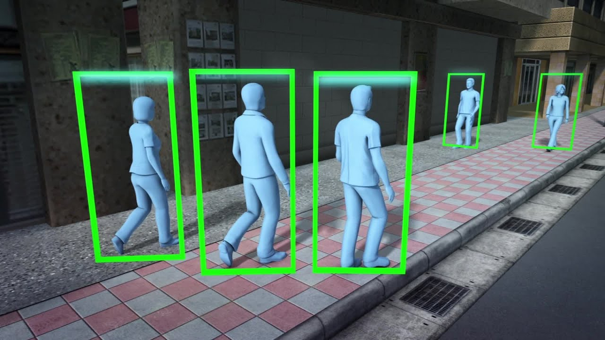
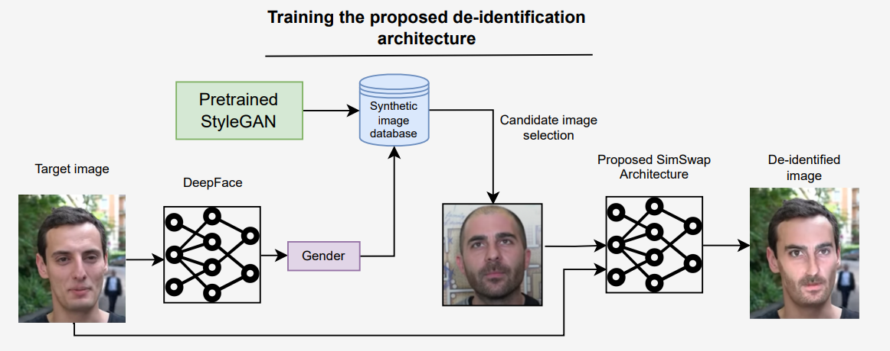

This is a collection of my personal projects that I work on in my free time. Hope you like them.

---
## Gait Recognition

Gait recognition is a challenging problem in computer vision that involves identifying individuals based on their walking patterns. Traditional methods for gait recognition rely on hand-crafted features and models that are often sensitive to variations in walking conditions and viewpoints. In recent years, deep learning techniques have shown promise in improving the accuracy and robustness of gait recognition systems.

In this project, we propose a novel approach to gait recognition that leverages the power of deep learning and graph neural networks. Our approach uses graph convolutional neural networks (GCNs) to learn features from gait data that capture both spatial and temporal dependencies. Specifically, we represent gait data as a spatiotemporal graph, where each node corresponds to a joint in the human body, and edges represent the connections between joints.

We use GCNs to learn node and edge embeddings that capture the features of each joint and their interactions with other joints over time. We then use these embeddings to train a deep neural network that can recognize individuals based on their gait patterns.

 

## De-identification
Face recognition is a powerful technology that has the potential to revolutionize various industries. However, it also raises significant concerns about privacy and surveillance. In many scenarios, it may be necessary to de-identify faces in images and videos to protect the privacy of individuals.

In this project, we propose a novel approach to face de-identification that leverages the power of Generative Adversarial Networks (GANs). Our approach uses a GAN to generate realistic and anonymized versions of input face images, which preserve the identity-neutral attributes of the original images while obscuring the specific details that could be used to identify individuals.

Our GAN architecture consists of two main components: a generator and a discriminator. The generator takes an input image and generates a de-identified version of the image, while the discriminator evaluates the quality of the generated images and provides feedback to the generator to improve its performance. By training the generator and discriminator together in an adversarial manner, we can achieve state-of-the-art results in face de-identification.

## BanglaLekha

Banglalekha was a Govt. funded project for improving the aesthetic quality of Bangla handwriting. Developed the official website of Banglalekha in wordpress (www.banglalekha.org) Developed the official android application of Banglalekha. The application is currently under review of ICT Division, Bangladesh

- Collected a dataset for Bangla handwritten characters
- Developed a architecture for Bangla handwritten character classification
- Developed an Android application for increasing the aesthetic beauty of childrens
- _Tools_: Python, Tensoflow-Keras, OpenCV-Python.

 

## Bangla News Article Classifier

An Deep Learning based model for classifying Bangla News Articles.  

- Collected a Bangla news article dataset 
- Developed deep learning based solution for the classification
- Render the order summary as a PDF and send it to the user after a successful transaction.
- _Tools_: Python, Tensoflow-Keras, NLTK, OpenCV-Python

 

## Topic Based Image Captioning

An automatic image caption generation system built using Deep Learning.

- Developed a model which uses Latent Dirichlet Allocation (LDA) to extract topics from the image captions.
- Developed a caption generation model using LSTMs which takes the image features from a pre-trained InceptionV3 network and the topics from the LDA-model as input.
- Made the caption generation model using merge model architecture.
- _Tools_: Python, Tensoflow-Keras, NLTK, OpenCV-Python, MSCOCO-2017 Dataset.

 

## ECom

An E-commerce website built using Django.  

- Built the backend entirely on Django. Used jQuery in some places to make the website asynchronous.
- Used signals, custom model managers, and custom querysets extensively to keep most of the code logic within the models and to make the communication between the linked models effective.
- In case of a server error, setup sendgrid to send a detailed error report to website admins.
- Built the functionality to sell digital items by storing them in AWS S3 Storage.
- Render the order summary as a PDF and send it to the user after a successful transaction.
- _Tools_: Python, Django, Bootstrap, jQuery, Ajax, jsrender, chart.js

 

